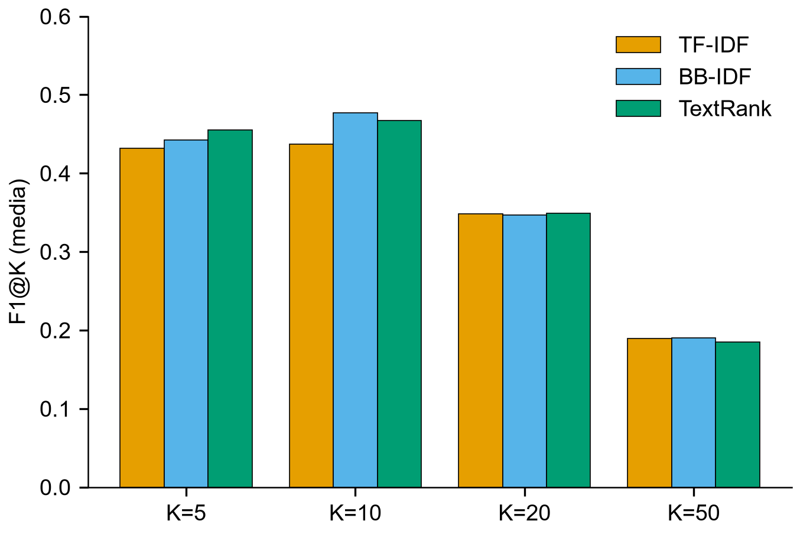
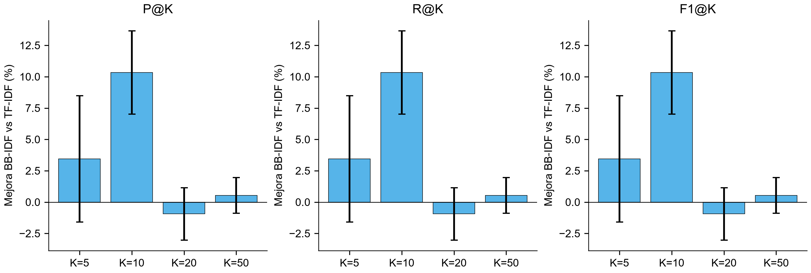

# bb-idf

Evaluación experimental de **BB-IDF** (Bounded Band Inverse Document Frequency),
una propuesta de mejora del TF-IDF para extracción de keywords, comparado contra
**TF-IDF** y contra **TextRank** (benchmark de referencia) sobre un corpus de
documentos académicos de turismo.

---

## Resumen ejecutivo

### Respuestas directas (n = 30 documentos)

1. **¿BB-IDF mejora a TF-IDF?** Sí, de forma **modesta y acotada a K = 10**:
   F1@10 = 0.437 → 0.477 (+10.3%). En K = 5/20/50 y en AP/MRR no hay mejora
   significativa; la mejora no es uniforme (gana 10/30, empata 19/30).
2. **¿La mejora es estadísticamente significativa?** Sí en **F1@10 y R@10**
   (p = 0.006), con tamaño de efecto **moderado** (Cohen's d = 0.56); P@10 es
   marginal (p = 0.025). No significativa en el resto de configuraciones.
3. **¿BB-IDF alcanza o supera a TextRank?** **Alcanza la paridad** (sin
   diferencias significativas). Supera ligeramente en F1@10 (0.477 vs 0.467,
   = 102% de TextRank), pero queda por debajo en AP (98%) y MRR (90%), a un
   coste **~460× menor** que TextRank.

### Resumen

- La evaluación se basa en **extracción de keywords** contra las **palabras
  clave declaradas por los autores** de cada documento (gold standard real, no
  inventado), con un protocolo reproducible y una comparación controlada entre
  los tres algoritmos.
- **Resultado principal:** BB-IDF (definido como TF-IDF cambiando *únicamente*
  el conteo de frecuencia documental `df → df_banda`) mejora a TF-IDF de forma
  **modesta y acotada**: significativa solo en **F1@10 / R@10** (p = 0.006,
  Cohen's d = 0.56, +10.3%).
- **Hallazgo crítico:** la variante de BB-IDF con **filtro duro** de banda (la
  que implementa `bb_idf/algorithms/bbidf.py`) es **inviable** para extracción
  de keywords (F1@10 ≈ 0.04): los umbrales de banda sobre conteos crudos anulan
  ~91% de los términos en documentos largos.
- **Costo:** BB-IDF cuesta ~2× TF-IDF y ~3 órdenes de magnitud menos que
  TextRank.
- **Alcance honesto:** con n = 30 documentos, la conclusión es exploratoria;
  la mejora es real pero **no uniforme** y **depende de K**.

---

## Mapa de archivos (referencia rápida para el investigador principal)

### Documentación
- [Informe experimental completo](docs/INFORME_EXPERIMENTAL.md) — resultado y análisis detallado.
- [Análisis de complejidad (Big-O)](docs/analisis_complejidad.md) — complejidad asintótica comparativa.
- [Recomendaciones de evaluación](docs/recomendaciones.txt) — plan original de evaluación.

### Orquestador y código de la evaluación
- [run_all.py](run_all.py) — ejecuta todo con un solo comando.
- [bb_idf/experiment/run.py](bb_idf/experiment/run.py) — orquestador (métricas + estadística + eficiencia).
- [bb_idf/experiment/pipeline.py](bb_idf/experiment/pipeline.py) — carga PDFs + preprocesado spaCy (cacheado).
- [bb_idf/experiment/scorers.py](bb_idf/experiment/scorers.py) — TF-IDF / BB-IDF / TextRank sobre el mismo vocabulario.
- [bb_idf/experiment/metrics.py](bb_idf/experiment/metrics.py) — P/R/F1@K, AP, MAP, MRR, nDCG@K.
- [bb_idf/experiment/stats.py](bb_idf/experiment/stats.py) — Wilcoxon, bootstrap CI, Cohen's d, rank-biserial.
- [bb_idf/experiment/gold.py](bb_idf/experiment/gold.py) — gold standard de autores (curado).
- [bb_idf/experiment/plots.py](bb_idf/experiment/plots.py) — figuras + nubes de palabras.
- [bb_idf/experiment/robustness.py](bb_idf/experiment/robustness.py) — robustez + análisis de casos.
- [bb_idf/experiment/similarity.py](bb_idf/experiment/similarity.py) — similitud de ranking con TextRank.
- [bb_idf/experiment/per_doc.py](bb_idf/experiment/per_doc.py) — export por documento (top-50 + nubes).

### Algoritmos (paquete original)
- [bb_idf/algorithms/tfidf.py](bb_idf/algorithms/tfidf.py) · [bb_idf/algorithms/bbidf.py](bb_idf/algorithms/bbidf.py) · [bb_idf/algorithms/textrank.py](bb_idf/algorithms/textrank.py)

### Resultados (generados)
- [results/metadata.json](results/metadata.json) — configuración y eficiencia reproducibles.
- Tablas: [summary.csv](results/processed/summary.csv) · [per_doc_wide.csv](results/processed/per_doc_wide.csv) · [improvement_bbidf_vs_tfidf.csv](results/processed/improvement_bbidf_vs_tfidf.csv) · [gap_to_textrank.csv](results/processed/gap_to_textrank.csv) · [paired_tests.csv](results/statistical/paired_tests.csv) · [similarity_tests.csv](results/statistical/similarity_tests.csv) · [robustness.csv](results/statistical/robustness.csv) · [band_diagnostic.csv](results/statistical/band_diagnostic.csv)
- Análisis por documento: [per_document.md](results/tables/per_document.md) · [case_analysis.md](results/tables/case_analysis.md)
- Keywords por documento: [documents_index.csv](results/per_document/documents_index.csv) (y `results/per_document/doc1/…doc33/`)
- Figuras clave: [f1_comparison.png](results/figures/f1_comparison.png) · [improvement_bbidf.png](results/figures/improvement_bbidf.png) · [efficiency.png](results/figures/efficiency.png) · [similarity_to_textrank.png](results/figures/similarity_to_textrank.png) (resto en `results/figures/`)

### Configuración y tests
- [pyproject.toml](pyproject.toml) · [tests/](tests/) · [main.py](main.py)

---

## 1. Pregunta de investigación y estructura conceptual

```
     TF-IDF
        │  propuesta de mejora (BB-IDF)
        ▼
     BB-IDF
        │  comparación contra benchmark
        ▼
    TextRank  (referencia)
```

**Pregunta principal:** *¿Cuánto mejora BB-IDF el desempeño de TF-IDF para la
extracción de keywords y qué tan cerca o lejos queda del desempeño de TextRank?*

La comparación **no** se plantea como una competición de tres algoritmos: la
hipótesis es la mejora TF-IDF → BB-IDF; TextRank es solo el punto de referencia
de calidad.

---

## 2. El método BB-IDF (propuesta)

**Bounded Band Inverse Document Frequency** ("IDF de Banda Acotada"). Evolución
del TF-IDF que introduce un **filtro de banda estadístico adaptativo por
documento** en el conteo de la frecuencia documental `df(t)`.

La motivación: en TF-IDF clásico, un documento cuenta para `df(t)` con una sola
mención del término. BB-IDF exige que la frecuencia del término caiga dentro de
una banda estadística de ese documento, filtrando:

- **Ruido** (mención casual, 1 aparición en un texto largo) → banda inferior.
- **Spam / keyword stuffing / palabras estructurales** → banda superior.

**Fórmulas.** Para cada documento `d`, con `μ_d, σ_d` calculados sobre las
frecuencias no nulas de sus términos (σ poblacional):

$$banda_d = [\,\mu_d + 0.5\,\sigma_d,\; \mu_d + 2.5\,\sigma_d\,]$$

Fallback `[1.5, 4.5]` si `banda_inf ≥ banda_sup` o el documento tiene < 30 tokens.

$$df_{banda}(t) = |\{\,d \;:\; banda\_inf_d \le f_{t,d} \le banda\_sup_d\,\}|$$

$$idf_{banda}(t) = \ln\frac{1+N}{1+df_{banda}(t)} + 1, \qquad w_{t,d} = f_{t,d} \cdot idf_{banda}(t)$$

**Variantes consideradas** (`bb_idf/experiment/scorers.py`):

| Variante | Definición | Resultado |
|---|---|---|
| `bbidf` (principal) | solo cambia `df → df_banda` | comparable a TF-IDF, iguala a TextRank |
| `bbidf_hard_band` | además anula pesos fuera de banda (como `bb_idf/algorithms/bbidf.py`) | **inviable** en docs largos (F1@10 ≈ 0.04) |

> La variante *principal* aísla el efecto del filtro de banda: difiere de
> TF-IDF **solo** en cómo se cuenta `df`, usando la misma fórmula de IDF y el
> mismo TF. Esto permite atribuir cualquier mejora al filtro, y no a un cambio
> de fórmula de IDF o de normalización.

---

## 3. Corpus y gold standard

- **33 documentos PDF** (tesis y artículos de turismo; región
  Amazonas/Chachapoyas, Perú).
- **31/33** documentos declaran **"Palabras clave(s)" / "Keywords"** del autor
  → se usan como **gold standard** (no inventado).
- **30 documentos** forman el conjunto de evaluación. Exclusiones (ver
  `bb_idf/experiment/gold.py`): 2 documentos sin keywords y 1 con keywords en
  inglés y cuerpo en español (se tradujeron fielmente, quedando 30).
- Longitud media: 5 461 tokens (mediana 5 195; rango 879–15 782). Gold: media
  6.5 términos/documento.
- El gold se normaliza con el mismo pipeline y se aplana a **unigramas de
  contenido** (los algoritmos son unigrama).

---

## 4. Preprocesamiento (idéntico para los 3 algoritmos y el gold)

1. Extracción de texto: PyMuPDF (`fitz`).
2. Tokenización + lematización: spaCy `es_core_news_sm` (sin parser/ner), `lemma_.lower()`.
3. Filtros: sin puntuación/espacios, sin stopwords (ES + mínima lista EN por el
   contenido bilingüe), sin tokens numéricos (`like_num`), **lema alfabético**
   (`isalpha`; elimina ISSN/DOI/URLs/símbolos), longitud ≥ 3.
4. **Vocabulario compartido** (unión de los 33 docs, V = 15 953) y **matriz de
   conteos compartida**: los tres algoritmos operan sobre el mismo espacio de
   términos, garantizando comparabilidad.

---

## 5. Algoritmos comparados

**TF-IDF**

$$w_{t,d} = tf_{t,d} \cdot idf(t), \qquad idf(t) = \ln\frac{1+N}{1+df(t)} + 1$$

**TextRank** — grafo de co-ocurrencia por documento + PageRank ponderado
(Mihalcea & Tarau 2004):

$$S(v_i) = (1-d) + d \cdot \sum_{v_j \in In(v_i)} \frac{w_{ji}}{\sum_{v_k \in Out(v_j)} w_{jk}} S(v_j)$$

> La ventana de co-ocurrencia es `N = 2` (valor que reporta mejores resultados
> en Mihalcea & Tarau 2004). La sensibilidad a este parámetro se evalúa en
> robustez con ventanas 2, 5 y 10.

---

## 6. Diseño experimental

| Elemento | Valor |
|---|---|
| Unidad experimental | documento (n = 30 evaluables) |
| K (Top-K) | 5, 10, 20, 50 |
| Métricas | P@K, R@K, F1@K, AP, MRR, nDCG@K |
| Comparación principal | BB-IDF vs TF-IDF (pareada por documento) |
| Comparación secundaria | BB-IDF / TF-IDF vs TextRank |
| Estadística | Wilcoxon signed-rank, bootstrap CI 95%, Cohen's d (pareado), rank-biserial |
| Eficiencia | tiempo, throughput y memoria pico (tracemalloc) |
| Robustez | ventana TextRank 2/5/10, variante de banda dura, diagnóstico de banda |

---

## 7. Métricas

- **P@K**: fracción del Top-K que es keyword de autor.
- **R@K**: fracción de keywords de autor recuperadas en el Top-K.
- **F1@K**: media armónica de P@K y R@K.
- **AP** (Average Precision): media de la precisión en cada posición relevante
  de un documento (resume su ranking completo).
- **MAP** (Mean Average Precision): media de AP sobre los documentos.
- **MRR**: inversa del rango de la primera keyword relevante.
- **nDCG@K**: DCG normalizado (relevancia binaria; aporta poco más que P@K con
  este gold, se reporta en los datos crudos pero no en las conclusiones).

**Comparabilidad de scores.** Los scores crudos de cada algoritmo están en
escalas distintas (TF-IDF/BB-IDF son `tf × idf`, del orden de cientos; TextRank
es PageRank, del orden de decenas). Para hacerlos comparables, todos los scores
exportados se **normalizan con L2 por documento** (`score = w / ‖w_d‖₂`, rango
[0, 1]); el valor crudo se conserva como `score_raw`. Esta normalización **no
afecta al ranking** (que es invariante a escala) ni a las métricas.

---

## 8. Resultados

### 8.1 Calidad (media, n = 30)

| Métrica | TF-IDF | BB-IDF | TextRank |
|---|---|---|---|
| F1@5 | 0.432 | 0.442 | **0.455** |
| F1@10 | 0.437 | **0.477** | 0.467 |
| F1@20 | 0.348 | 0.347 | 0.349 |
| F1@50 | 0.190 | 0.190 | 0.185 |
| P@10 | 0.363 | **0.397** | 0.387 |
| R@10 | 0.587 | **0.639** | 0.631 |
| MAP | 0.488 | 0.500 | **0.508** |
| MRR | 0.741 | 0.747 | **0.828** |



### 8.2 Mejora de BB-IDF sobre TF-IDF (F1@K)

| K | Mejora media | Mediana | p (Wilcoxon) | Cohen's d |
|---|---|---|---|---|
| 5 | +3.4% | 0.0% | 0.266 | +0.10 |
| **10** | **+10.3%** | 0.0% | **0.006** | **+0.56** |
| 20 | −0.9% | 0.0% | 0.750 | −0.04 |
| 50 | +0.5% | 0.0% | 0.625 | +0.02 |

En F1@10, BB-IDF gana en 10/30, empata en 19/30 y pierde en 1/30. La **mediana
de mejora es 0%** (dominan los empates): la ventaja es real pero concentrada en
~1/3 de los documentos.



### 8.3 Comparación contra TextRank (benchmark)

- **BB-IDF vs TextRank**: sin diferencias significativas (todos p > 0.2).
  BB-IDF alcanza **102%** del F1@10 de TextRank, **98%** de su MAP y **90%** de
  su MRR.
- **TF-IDF vs TextRank**: TextRank supera a TF-IDF en F1@5, AP y MRR; empate en
  F1@10/F1@20.
- BB-IDF supera a TextRank en 7/30 documentos (F1@10); TextRank a BB-IDF en 6/30.

### 8.4 Eficiencia (33 docs, sin preprocesado)

| Algoritmo | Tiempo total | Throughput | Memoria pico | Factor tiempo vs TF-IDF |
|---|---|---|---|---|
| TF-IDF | ~0.004 s | ~4 200 docs/s | ~8.5 MB | 1× |
| BB-IDF | ~0.009 s | ~2 200 docs/s | ~8.5 MB | ~2× |
| TextRank | ~5 s | ~6 docs/s | ~102 MB | ~1000× |

- **Tiempo/throughput**: sobre la matriz de conteos; el preprocesado spaCy
  (~60 s, cacheado) es compartido y no se incluye.
- **Memoria pico**: `tracemalloc` durante el ajuste. TextRank reserva el grafo
  de co-ocurrencia por documento (~12× más memoria que TF-IDF/BB-IDF).
- **Complejidad asintótica**: [docs/analisis_complejidad.md](docs/analisis_complejidad.md)
  — TF-IDF y BB-IDF son O(N·V); TextRank es O(N·(L̄·W + I·Ū²)).

### 8.5 Similitud de ranking con TextRank (análisis suplementario)

Además de la calidad, se mide cuánto se **parece** el ranking de cada algoritmo
al de TextRank (convergencia de comportamiento, no calidad). Métricas: RBO
(Rank-Biased Overlap, p=0.9), Jaccard@K y Overlap@K.

| Métrica | TF-IDF | BB-IDF | p (pareado) | Cohen's d |
|---|---|---|---|---|
| RBO@10 | 0.401 | **0.459** | 0.0002 | +0.71 |
| Jaccard@10 | 0.594 | **0.686** | 0.0003 | +0.86 |
| Overlap@10 | 0.727 | **0.800** | 0.0006 | +0.78 |

**BB-IDF es consistentemente más similar a TextRank que TF-IDF**, en todas las
métricas y en todos los K (significativo en K ≥ 10, p < 0.005). Esto es coherente
con el hallazgo principal: al aplanar el IDF a casi-constante, BB-IDF se comporta
como un ranking por frecuencia, más cercano al comportamiento de TextRank que al
de TF-IDF. (Interpretación como *convergencia de rankings*, no como calidad.)

---

## 9. Conclusiones (respuestas a la pregunta de investigación)

1. **¿BB-IDF mejora a TF-IDF?** Sí, pero **modestamente** y **solo en K = 10**
   (F1@10 y R@10, también P@10); en el resto de configuraciones es
   indistinguible.
2. **¿Cuánto?** F1@10: 0.437 → 0.477 (+10.3% de media), efecto moderado
   (d = 0.56). La mediana de mejora es 0% (muchos empates).
3. **¿Es significativa?** Sí en F1@10/R@10 (p = 0.006); no en K = 5/20/50 ni en
   AP/MRR.
4. **¿Es consistente?** No. Gana en 10/30, empata en 19/30, pierde en 1/30. La
   ventaja se concentra en documentos con keywords específicas y frecuentes.
5. **¿Qué tan cerca está BB-IDF de TextRank?** A la par: F1@10 = 102% del
   desempeño de TextRank, MAP = 98%, MRR = 90%.
6. **¿Costo computacional?** ~2× TF-IDF (0.009 s vs 0.004 s para 33 docs) y ~3
   órdenes de magnitud más barato que TextRank (4.1 s).

**Interpretación:** el filtro de banda aplicado *solo* al conteo de `df` aplanó
el IDF hacia casi-constante (91% de términos con `df_banda = 0`), convirtiendo
a BB-IDF en un ranking por frecuencia con penalización selectiva. Esto lo acerca
al comportamiento de TextRank y lo hace algo mejor que TF-IDF para keywords de
autor genéricas, pero el efecto es pequeño y dependiente de K.

**Qué no puede sostenerse con n = 30:** que BB-IDF sea globalmente superior a
TF-IDF o a TextRank; extrapolaciones a otros dominios; que la mejora sea grande
o universal. La versión con **filtro duro** (la implementada en
`bb_idf/algorithms/bbidf.py`) no es superior y debería revisarse antes de
cualquier uso.

---

## 10. Limitaciones

- **n = 30**: potencia limitada; conclusiones exploratorias.
- **Gold de unigramas**: los algoritmos son unigrama; no se evalúa la exactitud
  de frases completas ("capacidad de carga" se evalúa como {capacidad, carga}).
- **Lematizador español sobre texto inglés**: el artículo en inglés y los
  fragmentos bilingües no se lematizan bien ("tourists" ≠ "tourist").
- **Muchos empates** entre BB-IDF y TF-IDF (≈ 19/30 en F1@10).
- El corpus consta de 33 documentos; el archivo de consultas del repositorio
  (`queries.json`) no se empleó en esta evaluación.

---

## 11. Reproducibilidad

### Instalación

```bash
uv sync
python -m spacy download es_core_news_sm
```

### Ejecución (todo de una vez)

```bash
uv run python run_all.py                 # tests + métricas + figuras + robustez
uv run python run_all.py --skip-tests    # sin pytest
```

O paso a paso:

```bash
uv run python -m bb_idf.experiment.run         # métricas + estadística + eficiencia
uv run python -m bb_idf.experiment.plots       # figuras (incl. nubes de palabras)
uv run python -m bb_idf.experiment.robustness  # robustez + análisis de casos
```

El preprocesado con spaCy se cachea en `data/processed/preprocessed.pkl` y se
reutiliza entre pasos; bórralo si cambias el corpus o el preprocesado.

### Estructura de salida

```
results/
├── raw/            per_doc_metrics.csv, doc_info.csv
├── processed/      summary.csv, per_doc_wide.csv (una fila por documento),
│                   improvement_bbidf_vs_tfidf.csv, gap_to_textrank.csv
├── metrics/        keywords_ranked.csv (score L2 + raw), top10_keywords.csv
├── statistical/    paired_tests.csv, robustness.csv, band_diagnostic.csv
├── figures/        12 figuras PNG (ver §12)
├── tables/         case_analysis.md, per_document.md (Top-10 por documento con gold marcado)
├── per_document/   doc1/…doc33/: top-50 keywords (CSV) + nube de palabras por algoritmo,
│                   y documents_index.csv (docX → archivo original)
├── benchmark/      salida del benchmark computacional (main.py)
├── metadata.json   configuración reproducible
└── INFORME_EXPERIMENTAL.md
```

### Benchmark computacional (`main.py`)

```bash
uv run python main.py              # corrida única
uv run python main.py --runs 10    # media ± std (tiempos)
uv run python main.py --graphs     # gráficos en results/benchmark/figures/
uv run python main.py --scalability
```

> El benchmark de `main.py` emplea un ground truth de recuperación
> auto-referencial (cada consulta es un documento del propio corpus), por lo que
> sus métricas de ranking no discriminan calidad entre algoritmos. Se usa para
> comparar **eficiencia** (tiempos, memoria, dispersión); la evaluación de
> **calidad** es la del experimento de keywords (§1).

---

## 12. Figuras (`results/figures/`)

| Figura | Contenido |
|---|---|
| `prf_at_k.png` | P@K, R@K, F1@K de los 3 algoritmos (curvas con valores anotados) |
| `f1_comparison.png` | F1@K por algoritmo (barras con valores) |
| `f1_with_ci.png` | F1@K con intervalo de confianza 95% |
| `improvement_bbidf.png` | Mejora % de BB-IDF vs TF-IDF (media ± SE) |
| `per_doc_boxplot.png` | Distribución por documento (F1@10, AP) con puntos individuales |
| `paired_diff_f1.png` | Histograma de diferencias pareadas (BB-IDF − TF-IDF) en F1@10 |
| `heatmap_f1_doc.png` | F1@10 por documento × algoritmo (valores en cada celda) |
| `efficiency.png` | Tiempo total, tiempo/doc, memoria pico y throughput (panel 2×2) |
| `quality_time_tradeoff.png` | F1@10 vs tiempo (escala log) |
| `wordclouds.png` | **Nubes de palabras** de cada algoritmo (score acumulado) |
| `keyword_frequency.png` | Top-20 términos más frecuentes en el Top-10 de cada algoritmo |
| `similarity_to_textrank.png` | Similitud de ranking con TextRank (RBO) de TF-IDF vs BB-IDF |

---

## 13. Estructura del repositorio

```
bb_idf/
├── algorithms/       TF-IDF (tfidf.py), BB-IDF (bbidf.py), TextRank (textrank.py)
├── experiment/       Evaluación de keywords (lo nuevo)
│   ├── gold.py           gold standard de autores (curado)
│   ├── pipeline.py       carga PDFs + preprocesado spaCy (cacheado)
│   ├── scorers.py        TF-IDF / BB-IDF / TextRank sobre el mismo vocabulario
│   ├── metrics.py        P/R/F1@K, AP, MRR, nDCG@K
│   ├── stats.py          Wilcoxon, bootstrap CI, Cohen's d, rank-biserial
│   ├── run.py            orquestador (métricas + estadística + eficiencia)
│   ├── plots.py          figuras + nubes de palabras
│   └── robustness.py     robustez + análisis de casos
├── preprocessing/    Preprocessor spaCy (paquete original)
├── evaluation/       benchmark computacional (paquete original)
└── reporting/        gráficos/estadística del benchmark computacional

data/corpus/          PDFs (gitignored)
data/qrels/           queries.json (referencia no empleada en esta evaluación)
notebooks/            notebooks de referencia (gitignored)
nuevo/                propuesta original .docx + .ipynb (gitignored)
results/              salidas del experimento
docs/                 INFORME_EXPERIMENTAL.md, recomendaciones.txt
tests/                pytest
main.py               benchmark computacional
run_all.py            genera todo de una vez
```

---

## Referencias

- Mihalcea, R., & Tarau, P. (2004). TextRank: Bringing Order into Text. *EMNLP*.
- Ramos, J. (2003). Using TF-IDF to Determine Word Relevance in Document Queries. *ICML*.
- Pedregosa, F. et al. (2011). Scikit-learn: Machine Learning in Python. *JMLR*, 12, 2825-2830.
